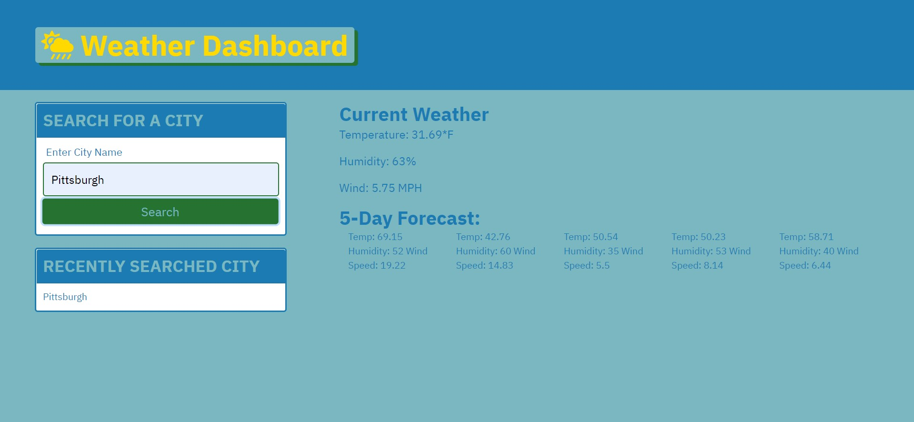

# weather-dashboard

# <weather-dashboard>

## Description

- Optimized website to efficently provide weather data.
- "Search by city" feature to make finding your location easier.
- Created to make a safe homepage for current weather and the five day forecast.

## Table of Contents

- [Installation](#installation)
- [Usage](#usage)
- [Credits](#credits)
- [License](#license)

## Installation

This weather dashboard is embedded in a URL. No installation required. 

## Usage

Once the website is launched, you will be brought to a main menu. Navigate to the search city option and type in desired city. Click on the search button to view results. current weather information will be displayed at the top while the 5 day forecast will be displayed below. Enjoy! 

## Credits

Kyle Giuanta https://github.com/kgiunta

Isaak Morales https://github.com/CallMeIce

## License
Not Applicable

## Badges

